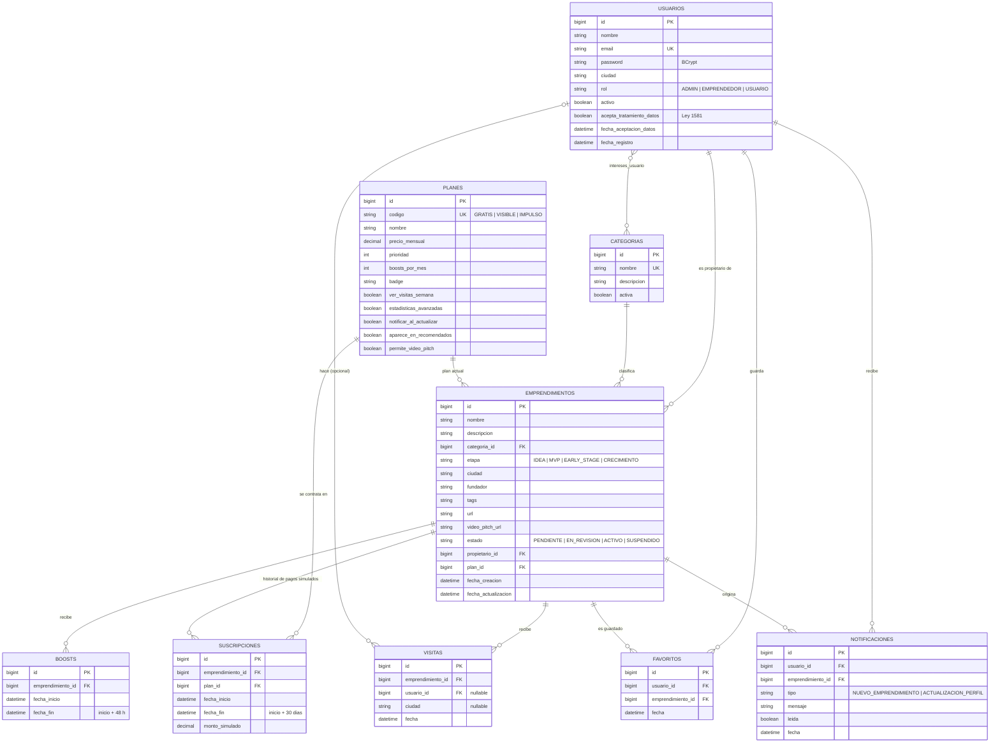

# innovaFeed — Diagrama entidad-relación

## Decisiones clave
- **Rol** es un enum guardado en `usuarios.rol`: cada persona tiene un solo rol.
- **Plan** es una tabla: precio y beneficios se cambian sin tocar código.
- **intereses_usuario** es una tabla intermedia N:M (sin entidad propia).
- **emprendimientos.plan_id** guarda el plan vigente; **suscripciones** guarda el historial.
- Orden del catálogo: boost activo > `planes.prioridad` > `fecha_creacion` más reciente.
